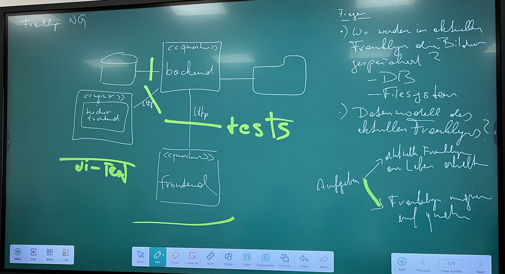

= Minutes of Meeting
Franklyn 3 Dev-Team
2022/23
:toc:
:icons: font

== 2022-01-17

.Teilnehmer
[%collapsible]
====
|===
|anwesend | |

|Vorname
|Nachname
|Klasse

|
| Prof. Stuetz
|

| Tamara
| Melcher
| 4AHIF

| Michael
| Tran
| 4AHIF
|===
====
.Ort und Zeit
[%collapsible]
====
[cols=2*]
|===
|Ort
|Online (Discord)

|von-bis
|Mo. 17.01.2022, 9.20 - 9.45
|Dauer
| 25 Minuten
|===
====

=== Besprochene Themen
* Das neue Github-Repo wurde initialisiert
* Ein neues UTrack Projekt wurde für Franklyn2 in Quarkus
* Weitere Schritte wurden besprochen
** Image Upload
** Demnächst ein Treffen mit der 5ahif ausmachen

== 2022-01-24
.Teilnehmer
[%collapsible]
====
|===
|anwesend | |

|Vorname
|Nachname
|Klasse

| Jonas
| Birklbauer
| 5AHIF

| Nico
| Bojer
| 5AHIF

| Tarik
| Hosic
| 5AHIF

| Tamara
| Melcher
| 4AHIF

| Michael
| Tran
| 4AHIF
|===
====

.Ort und Zeit
[%collapsible]
====
[cols=2*]
|===
|Ort
|Online (Discord)

|von-bis
|Mo. 24.01.2022, 18.00 - 18.20
|Dauer
| 20 min.
|===
====

=== Besprochene Themen

* Dokumenten übergabe
* Implementierung im Quarkus
* Was sind die nächsten Schritte

=== Vereinbarungen und Entscheidungen

.Was wurde vereinbart?
[%autowidth]
|===
|wer |macht was |bis wann

| Michael Tran / Tamara Melcher
| neues Quarkus Projekt erstellen
| nächste SYP-Stunde (25. Jän 2022)

| Michael Tran / Tamara Melcher
| Upload von Bildern im im Backend
| nächste SYP-Stunde (25. Jän 2022)
|===

== 2022-01-25

=== Ziele des Projektes

* Aufrechterhaltung des Betriebs von Franklyn 1
** Dazu zählen die beiden Instanzen:
*** Produktivsystem franklyn.htl-leonding.ac.at
*** Ausfallsystem franklyn2.htl-leonding.ac.at

* Neuentwicklung des Franklyn in Quarkus
** Backend als Quarkus
** Student-Frontend ev. als Quarkus
** Teacher-Frontend ev. als Quarkus

=== Nächste Schritte

* Kennenlernen der wichtigsten Funktionen des bestehenden Franklyn-Produktivsystem
** Starten
** Stoppen
** Ausführen von Shell-Commands

* Machbarkeitsstudie
** Screenshoter in einer Quarkus App
** Image Upload

* Ist-Zustandserhebung des derzeitigen Produktivsystems
** Besonders wichtig sind die Business-Rules
*** zB Ab welcher Speicherauslastung werden automatisch die ältesten Tests gelöscht?
*** Wie werden die Images gespeichert?(Festplatte oder Files?)
*** Datenmodell

== 2022-03-01

.Teilnehmer
[%collapsible]
====
|===
|anwesend | |

|Vorname
|Nachname
|Klasse

|
| Prof. Stuetz
|

| Tamara
| Melcher
| 4AHIF

| Michael
| Tran
| 4AHIF
|===
====

.Ort und Zeit
[%collapsible]
====
[cols=2*]
|===
|Ort
|Online (Discord)

|von-bis
|Di. 01.03.2022, 14:45 - 16:40
|Dauer
| 55 Minuten
|===
====

=== Nächste Schritte

* Mehrere Clients anmelden
** Screenshot nach Client benennen

* docker-compose für backend

* docker-compose für die Datenbank (postgres)

* Einrichten der CI/CD - Pipeline

* Keycloak einrichten
** Berechtigungen für Schul-Keycloak von Prof. Stütz

=== Fragen
* Datenbankstruktur derzeit?

== 2022-03-07

.Teilnehmer
[%collapsible]
====
|===
|anwesend | |

|Vorname
|Nachname
|Klasse

|
| Prof. Stuetz
|

| Tamara
| Melcher
| 4AHIF

| Michael
| Tran
| 4AHIF
|===
====

.Ort und Zeit
[%collapsible]
====
[cols=2*]
|===
|Ort
|HTL Leonding

|von-bis
|Mo. 07.03.2022, 8:45-9:30
|Dauer
| 45 Minuten
|===
====

=== Besprochene Themen

* Problem in der Applikation
* Fragen, die wir der 5. noch stellen müssen
* Systemarchitektur vom Franklyn

=== Problemstellung

@Scheduled hat nicht funktioniert. Applikation hat nur einen Screenshot gemacht und dann nichts mehr.

=== Lösung

Port war bereits besetzt von Docker Containern, die darauf liefen.

=== Fragen
* Wo werden im aktuellen Franklyn die Bilder gespeichert?
** Datenbank
** Filesystem

* Datenmodell des aktuellen Franklyn

=== Systemarchitektur

Wurde gemeinsam mit Herr Prof. Stütz besprochen und aufgezeichnet.

== 2022-03-09
.Teilnehmer
[%collapsible]
====
|===
|anwesend | |

|Vorname
|Nachname
|Klasse

| Jonas
| Birklbauer
| 5AHIF

| Nico
| Bojer
| 5AHIF

| Tarik
| Hosic
| 5AHIF

| Tamara
| Melcher
| 4AHIF

| Michael
| Tran
| 4AHIF
|===
====

.Ort und Zeit
[%collapsible]
====
[cols=2*]
|===
|Ort
|HTL Leonding

|von-bis
|Mo. 09.03.2022, 11.55 - 12.20
|Dauer
| 25 min.
|===
====

=== Besprochene Themen

* Instandhaltung von Franklyn 2
** Über VM lassen uns Datenblatt noch zukommen
** Gemeinsam am 10.03 mit der 5ahif Zugriff auf die Franklyn VM einrichten
*** Zeigen uns wie wir den Franklyn starten und stoppen können

* Datenmodell vom Franklyn 2
** Ist im Franklyn 2 im Server/server/app/models abgebildet

* Welche Datenbank wurde genutzt, um die Bilder zu speichern
** MongoDB

== 2022-03-14

.Teilnehmer
[%collapsible]
====
|===
|anwesend | |

|Vorname
|Nachname
|Klasse

|
| Prof. Stütz
|

| Tamara
| Melcher
| 4AHIF

| Michael
| Tran
| 4AHIF
|===
====

.Ort und Zeit
[%collapsible]
====
[cols=2*]
|===
|Ort
|HTL Leonding

|von-bis
|Di. 21.03.2022, 14.40 - 15.20
|Dauer
| 40 min.
|===
====

=== Besprochene Themen

* Datenmodell des Franklyn2
* Teacher-frontend
* Lehreranmeldung
* Schüleranmeldung
* Speichern der Screenshots -> in Filesystem

===  Nächste Schritte

* Teacher-frontend rauswerfen
* 1 Entität reaktiv programmieren
** Entität testen
** Testdaten schreiben
* Anmeldung von Lehrern und Schüler herausfinden

=== Fragen

* Was wird in der MongoDB gespeichert?
** Wo?
* Was ist die Struktur der MongoDB
* Wie funktioniert die Anmeldung in Franklyn?
** Welcher Programmteil greift auf WebUntis zu?
** Was kommt retour?
** Was davon wird in der DB gespeichert?
** Gibt es einen Testlehrer für WebUntis?

=== Bemerkungen

* Alle 5 Minuten Request an Server, ob Client noch online
* keine Katalognummer
* enrolementNr automatisch zuweisen
* config -> application properties
* RestClient Insomnia

== 2022-03-21

.Teilnehmer
[%collapsible]
====
|===
|anwesend | |

|Vorname
|Nachname
|Klasse

|
| Prof. Stütz
|

| Tamara
| Melcher
| 4AHIF

| Michael
| Tran
| 4AHIF
|===
====

.Ort und Zeit
[%collapsible]
====
[cols=2*]
|===
|Ort
|HTL Leonding

|von-bis
|Mo. 21.03.2022, 10.00 - 10.50
|Dauer
| 50 min.
|===
====

=== Besprochene Themen

* Nächste Schritte
** Datenmodell (Entity-Klassen)
*** Was bedeuten (machen) die einzelnen Felder
** Erste Funktionalität reaktiv programmieren und anschließend mit Betreuer besprechen
*** Upload von Bildern
*** Nicht-blockierendes Speichern in DB
** Schnittstellenbeschreibung des Legacy-Systems
*** Beschreibung der filenamen

[plantuml,sys-arch,png]
----
@startuml
node screenshots << filesystem >>
node backend << quarkus >>
node client << desktop-compose >>
backend -- client: rest
backend -right- screenshots
@enduml
----

== 2022-03-24

.Teilnehmer
[%collapsible]
====
|===
|Vorname |Nachname |Klasse

| Jonas
| Birklbauer
| 5AHIF

| Nico
| Bojer
| 5AHIF

| Tarik
| Hosic
| 5AHIF

| Lorenz
| Gahleitner
| 5AHIF

| Tamara
| Melcher
| 4AHIF

| Michael
| Tran
| 4AHIF
|===
====

.Ort und Zeit
[%collapsible]
====
[cols=2*]
|===
|Ort
|HTL Leonding

|von-bis
|Do. 24.03.2022,
|Dauer
|
|===
====

=== Besprochene Themen

* Franklyn VM
** Zugang
** Starten und Stoppen vom Franklyn
* Filesystem und Datenbank
** Referenz von der Datenbank auf das Filesystem
** Struktur des Filesystems
*** Exams -> Screenshots -> Examinees
**** Screeshot number mit examineeid und examid
* Testlehrer
** Daten in Discord
* Schnittstellenbeschreibung
* Beschreibung der Felder
** enrolemntnr -> wievielte person man ist, die sich anmeldet
** module -> anonyme Klasse, kann man weglassen
* Anmeldung
** Frontend schickt Anmeldedaten an Server -> prüft Anmeldedaten
** Methode in server -> app -> controller -> services

== 2022-03-29

Anwesend Prof. Stuetz, Prof. Bucek, Tamara Melcher, Michael Tran

.Teilnehmer
[%collapsible]
====
|===
|Vorname |Nachname |Klasse

|
| Prof. Stuetz
|

|
| Prof. Bucek
|

| Tamara
| Melcher
| 4AHIF

| Michael
| Tran
| 4AHIF

|===
====

=== Was wurde besprochen?

* `Form` -> `SchoolClass` umbenannt
* Assoziative Tabelle
** `Exam` und `SchoolClass`
** `Examiner` und `Exam` machen
* `Examinee` soll auf die `Exam` referenziert werden
* Screenshot
** Examinee-Referenz hinzufügen
** `screenshotNumber` -> `runningNo` ändern
* Wie funktioniert der `ImageCompressor`?
** Vorgang `ImageCompressor` Bild komprimieren
* Resolution einmalig in `Exam` initialisiert werden

=== Vereinbarung
* Datenmodell erstellen
* reaktiv machen (jdbc der nicht blockiert, ...)

== 2022-06-20

.Teilnehmer
[%collapsible]
====
|===
|Vorname |Nachname |Klasse

|
| Prof. Stuetz
|

| Tamara
| Melcher
| 4AHIF

| Michael
| Tran
| 4AHIF

|===
====

=== Was wurde besprochen?

* Was wir gemacht haben

=== Vereinbarung
* GitHub-Repository in Ordnung bringen
* Funktionierende Endpoints
* Sachstandsbericht
* Projekt an sich aufräumen (zb unbrauchbare Dependencies entfernen)

== 2022-06-20

.Teilnehmer
[%collapsible]
====
|===
|Vorname |Nachname |Klasse

|
| Prof. Stuetz
|

|
| Prof. Bucek
|

| Tamara
| Melcher
| 4AHIF

| Michael
| Tran
| 4AHIF

|===
====

=== Was wurde besprochen?

* Was wir seit Montag (20.06.22) gemacht haben
** Endpoints funktionsfähig
** Client Website "aufgehübscht"
** Projekt aufgeräumt

=== Vereinbarung
* Quarkus-Projekt updaten
* Richtiges Datenmodell
* Speicherung eines neuen Screenshots in der DB

== 2022-06-24

.Teilnehmer
[%collapsible]
====
|===
|Vorname |Nachname |Klasse

|
| Prof. Stuetz
|

| Tamara
| Melcher
| 4AHIF

| Michael
| Tran
| 4AHIF

|===
====

=== Was wurde besprochen?

* Datenmodell
** Id hinzufügen
** ExamineeDetails weg und zu Examinee hinzufügen
** Examiner und Exam (ManyToMany) -> Assoziationstabelle
** Statt Number Integer
** Keine Liste speichern -> nicht möglich
*** Wird durch WebUntis-Username authentifiziert
*** Beim Erstellen eines Exams werden alle Examiner aus WebUntis geholt
* Erstellung der Datenbank
** Nicht mit postgres-run-in-docker.sh
** Sondern postgres-create-db.sh und postgres-start-db.sh
* Reaktives Programmieren
** Objekt von der Datenbank bekommen
* Konfigurationen im .env-file
** WebUntis credentials
** Pfad der Screenshots

=== Fragen

* Was bedeutet Enumeration Resolution -> HD, NATIVE, FHD
** Wie groß die Auflösung sein soll -> Standard: HD
* Welche Rechte hat der Examiner, wenn er Admin ist?
** Einen Examiner löschen

=== Vereinbarung
* Ändern des Datenmodells
* Anwendung des Datenmodells auf die Entitäten
* Speichern des neuen Screenshots in die DB
* Beim Schicken des Screenshots muss die ID des Clients mitgeschickt werden

=== Wartung des Franklyn-Servers

* Franklyn-Server wartet sich selber
+* Löscht Examen von letztem Jahr

=== Datenmodelle

==== Vor der Besprechung

[plantuml]
----
include::plantuml/classDiagram_before.puml[]
----

==== Nach der Besprechung

[plantuml]
----
include::plantuml/classDiagram.puml[]
----

== 2023-05-16

.Teilnehmer
[%collapsible]
====
|===
|Vorname |Nachname |Klasse

|
| Prof. Stuetz
|

| Mona
| Angerer
| 4BHITM

| Al Sabagh
| Abdulrahman
| 4BHITM

| Peter
| Klose
| 4BHITM

| David
| Thaller
| 4BHITM
|===
====

.Notizen
[%collapsible]
====
* Bezeichnung Franklyn: "Ist ein Softwaresystem, welches in periodischen Einsatzzwecken verwendet wird."
====

=== Besprochene Themen

* ERD jetzt und anschließende Überarbeitung
* Bilder sollen in Temp file gespeichert werden - umgehen der fehlenden Berechtigung
* Jeder muss sich anmelden und hat ein Konto
** Schüler: weiterhin einen Anmeldescreen
** Lehrer: können Test und Klassen anlegen
** Super-Admin: kann angemeldete zu Lehrern aufstufen
*** Lehrer, die sich mit unserer Schulmail anmelden sind automatisch Lehrer

**Erweiterung:**

* Anzeige im Dashboard:
** fehlende Schüler: rot
** einmal angemeldet: gelb
** nicht angemeldet: rot

**eventuelle Erweiterung:**

* Permissions:
** keycloak: Die Rechte im Webuntis holen
** keycloak nur für webuntis

* Ergänzung von IP-Adresse:
** warnings anzeigen bei Änderung

=== Vereinbarung (zukünftige Arbeitsschritte)

* Änderung zu jedem Bild speichern
** Anzahl der Codezeilen
** Prozentsatz zum vorherigen Bild
* Nur Differenzen und Alpha-frames schicken
* Screenshots als Film downloaden

== 2023-05-23

* Überarbeitung des Datenmodells

* Versuchen ob 60 mal pro Minute erstellt werden

* Dokumentation des zukünftigen Codes

== 2023-06-06

.Teilnehmer
[%collapsible]
====
|===
|Vorname |Nachname |Klasse

|
| Prof. Stuetz
|

|
| Prof. Aberger (Online)
|

| Mona
| Angerer
| 4BHITM

| Al Sabagh
| Abdulrahman
| 4BHITM

| Peter
| Klose
| 4BHITM

| David
| Thaller
| 4BHITM
|===
====

=== Besprochene Themen

Es sollen mehrere Bilder gleichzeitig, parallel gespeichert werden können.

Es können 100 mal so viel Clients wie Server erstellt werden.

Es gibt mehrere kleine Webserver.

Der Lehrerclient lädt das Bild von einem Webserver herunter.

Der Server verwaltet die ganzen Tests, Schüler, Rechner, Applikationen, Authentifizureng und Differenzen

Schülerrechner können auf server welcher in demilitarisierte Zone (DMZ) zugreifen, jedoch nicht über das Internet

Problem: die Clients und Lehrer dürfen nicht aufeinander zugreifen.

Die URL wird an unseren Reverse Proxy (nginx) gesendet.
Im DMZ können wir beliebig viel Proxys verwenden.

Browser ist im [.line-through]#TeacherClient# instructorClient

instructorClient ist ein RestClient:   wird an Webserver gesendet.

Streaming Server:
holt sich mit Diffs die Daten
->ein Ordner für jeden Schüler, ...

Aufgabe Client: kann auf Anfrage ein http request machen und schickt divs an Streaming und an Lehrer

Es werden drei Docker-Container verwendet: Streaming, nginx und Repository.

In Zukunft ist geplant, einen Prototyp zu erstellen, der die Konvertierung von PNG-Dateien in JPG und von JPG-Dateien in MP4 ermöglicht

==== Wir haben drei Arten von Servern:
(Server wird mit Docker Compose betrieben)

* App Server:
** Zuständig für die Verwaltung von Tests und die Authentifizierung.
* Streaming Server:
** Zuständig für die Zusammenführung von Bildern und die Generierung von MP4-Dateien.
* Webserver (aktueller Schülerclient):
** Zuständig für die Differenzberechnung und Aufnahme von Screenshots.

==== Funktion:

* Der Lehrerclient holt sich die Bilder von den Schülerwebservern.
Dabei handelt es sich nur um reine Screenshots (ohne Alpha- und Betaframes).
Diese müssen auch in JPG konvertiert werden.

* Unser Reverse Proxy repräsentiert die DMZ. Die Schülerwebserver müssen auch die Differenzen alle n Sekunden an den Server senden.

* Am Ende des Tests oder nach einer bestimmten Zeit werden die Alpha- und Betaframes verwendet, um ein MP4-Video zu generieren.
Der Lehrer kann die Videos am nächsten Tag herunterladen.

==== Ziele für dieses Schuljahr:
Entwicklung eines funktionierenden Systems ohne Streaming Server.
Es wird jedoch ein Prototyp für einen Streaming Server benötigt.
// Template
// == yyyy-mm-dd

// .Teilnehmer
// [%collapsible]
// ====
// |===
// |Vorname |Nachname |Klasse
//
// |
// | Prof. Stuetz
// |
//
// | Mona
// | Angerer
// | 4BHITM
//
// | Al Sabagh
// | Abdulrahman
// | 4BHITM
//
// | Peter
// | Klose
// | 4BHITM
//
// | David
// | Thaller
// | 4BHITM
// |===
// ====

// === Besprochene Themen
// === Vereinbarung