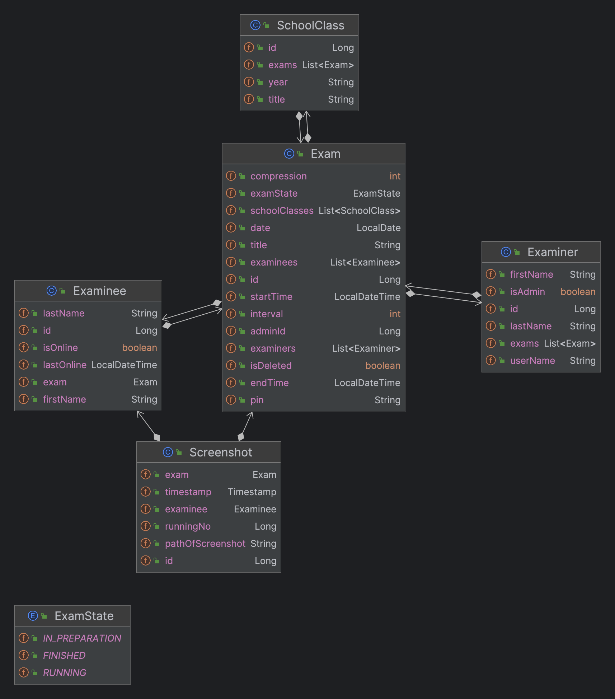
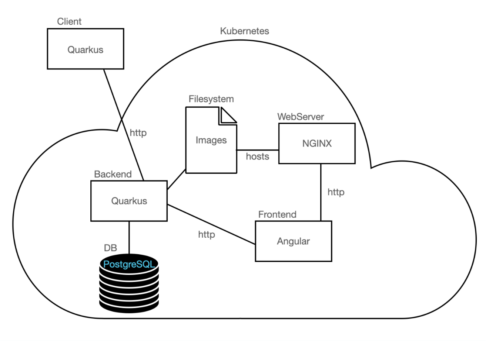

= Systemspezifikation
Melcher Tamara und Tran Michael
31.01.2022
:toc:
:icons: font

== Ausgangssituation

Die HTL Leonding ist eine HTL im Zentralraum von Oberösterreich mit ca. 1200 Schülern und Schülerinnen und den Fachbereichen Medientechnik, Informatik, Elektronik und Medizintechnik.
Ab der 3. Klasse werden die Informatik- und Medientechnik-Schüler in Gruppen von 3-4 Personen eingeteilt und arbeiten gemeinsam an einem Projekt.

== Ist-Zustand

Derzeit gibt es bereits eine Anwendung, welche Lehrkräfte bei der Durchführung von Tests hilft, indem sie in einem bestimmten Intervall einen Screenshot vom Bildschirm des Schülers/der Schülerin erstellt, auf welche die Lehrperson Zugriff hat.

=== Use Case Diagramm

[plantuml]
----
include::plantuml/ucd.puml[]
----

== Was ist Franklyn?
Franklyn wurde bereits von Schülern programmiert.

Franklyn ist eine Applikation, welche Schülern eine der Berufswelt entsprechende Arbeitsumgebung während Leistungsfeststellungen bietet.

Lehrkräfte bekommen die Möglichkeit, Testsitzungen zu erstellen. Schüler können sich zu einer Sitzung mit einem PIN und dem Vor- und Nachnamen anmelden.
Der Schülerclient sendet dabei in einem regelmäßigen Intervall Screenshots, welche sich die Lehrkraft ansehen können.
Für die Ansicht der Screenshots wird noch das Patroulierintervall angeboten, welches einem ermöglicht, automatisch durch die Screenshots der Schüler und Schülerinnen zu iterieren.

== Problemstellung
* Franklyn2 wurde mit Node.js geschrieben.
** Es gibt sehr viele Libraries mit unterschiedlichen Maintainer. D.h. beim Updaten dieser müssen die Funktionen genau überprüft werden.

* Die derzeitige Datenbank ist eine nicht-relationale DB (MongoBD)
** unstrukturierte Speicherung von Daten
** Aufgrund der vielen Entitäten ist eine relationale DB sinnvoller

* Wenn einE SchülerIn einen Fehler bei der Abgabe tätigt und den falschen Ordner abgibt, bleibt dem unterrichtenden Professor nichts anderes übrig, als ihm/ihr eine negative Note zu geben
* Bei einer großen Anzahl von SchülerInnen können Professoren bei einem Test schnell den Überblick verlieren bzgl. Unverständlichkeiten oder Problematiken die mehrere SchülerInnen betreffen

== Zielsetzung

* Lehrkräfte sowie SchülerInnen während eines Testes zu unterstützen
* Um es wie in der realen Welt zu gestalten, dürfen die SchülerInnen das Internet benutzen. Dabei soll es jedoch fair bleiben.

== Technische Details

=== Datenmodell

=== Systemarchitektur

* Technologie, Aufgaben

** Frontend
*** Angular-Anwendung
*** Dashboard zum Verwalten und Anlegen eines Testes
*** Download des Clients

** Server
*** Quarkus-Applikation
*** Speichert die Screenshots in der Datenbank und dem Filesystem
*** Stellt die für den Client benötigte API zur Verfügung
*** Stellt die für das Frontend benötigte API zur Verfügung

** DB
*** Postgres
*** Speichert die Screenshots
*** Speichert die Daten der Examiner, Examinee und die Links zu den Screenshots

** Client
*** Quarkus-Applikation
*** Verbindet Schüler, nach positiver Eingabe des PINs, mit dem Server

