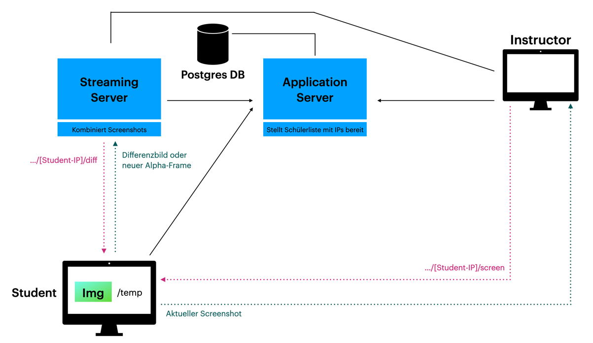

= System specification (Franklyn3 Relaunch)
Franklyn 3 Dev-Team
2023/24: franklyn-quarkus
ifndef::imagesdir[:imagesdir: images]
:sourcedir: ../src/main/java
:icons: font
:sectnums:    // Nummerierung der Überschriften / section numbering
:toc: left

== architecture of the system

== usecase diagram

[plantuml,img2,svg]
----
include::../plantuml/usecase-diagram.puml[]
----

