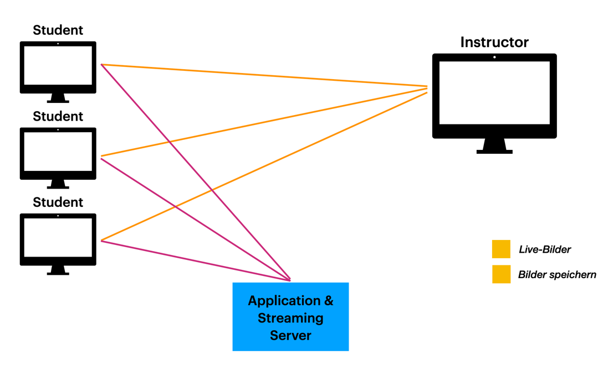

= Franklyn-3

ifndef::imagesdir[:imagesdir: ../images]
:icons: font

== Was ist Franklyn?

Ein Tool, welches Bildschirmaufnahmen von angemeldeten PCs erstellt und diese dem Host präsentiert.

== Problem bei Franklyn-2

* Alle 3 Sekunden erhält der Lehrer ein Bild von jedem Schüler
* Test (2h lang - ca. 30 Schüler - alle 3s ca. 1 MB großes Bild)
** Datenmenge gesamt = 72 GB
** Datenmenge pro s = 30MB

== Wie funktioniert Franklyn?

=== Aufbau

== Examinee-Client

* Nimmt in regelmäßigen Abstand Screenshots auf wandelt diese in Alpha- und Beta-Frames um und schickt Sie zum Streaming-Server, wo diese gespeichert werden.
* Nimmt aktuellen Screenshot auf Anfrage von Instructor-Client auf und stellt diesen bereit. Dieses Bild wird nicht gespeichert.

== Frame-Management

In unserer Architektur unterscheiden wir zwischen 3 bzw. 4 Frame Arten

=== Live-Bilder

* einfachste Möglichkeit Bilder zu erhalten
* keine Speicherung notwendig
* nur dann aufgenommen und bereitgestellt, wenn Instructor-Client diesen Examine beobachtet.

=== Alpha- u. Beta-Frames

* Bilder werden regelmäßig aufgenommen und verarbeitet zu
** Alpha-Frames - vollständiges Bild
** Beta-Frames - Änderungen zum letzten Alpha-Frame
* Das jeweilige Bild wird zum Streaming-Server geschickt

[.columns]
=== Beispiel Alpha- u. Beta-Frame

[.column]
--
Alpha-Frame

image::slides-alpha-example.png[size=cover]
--
[.column]
--
Beta-Frame

image::slides-beta-example.png[size=cover]
--

=== Stream-Bilder bzw. Video

Am Ende werden die Alpha- und Beta-Frames zusammengelegt und aus ihnen wird ein MP4 Video erstellt.

== Instructor

* Kann einen Test erstellen und diesen entweder einer Klasse zuteilen und oder per PIN zugänglich machen.
* Während des Tests kann er entweder im zufallsprinzip die Bildschirme beobachten oder sich einen Schüler aussuchen,
den er beobachten möchte.

== Streaming-Server

* Setzt Alpha und Beta-Frames wieder zusammen
* Speichert die zusammengesetzten Screenshots, um eine History nach dem Test bereitzustellen
* Kann ein Video aus besagten Screenshots erstellen

== Application-Server

* Händelt die Anmeldung und Verwaltung der Benutzer
* Stellt für den Streaming-Server und den Instructor-Client die nötigen Information bereit (Adressen der Examinees)

[.columns]
== Projektstruktur Überblick:

[.column]
--
Aktuelle Projektstruktur

image::slides-architektur-aktuell.png[]
--
[.column]
--
Ziel-Projektstruktur

image::slides-architektur-ziel.png[]
--

== Projektstruktur - Aktuell:

image::slides-architektur-aktuell.png[]

== Projektstruktur - Zukünftig:

image::slides-architektur-ziel.png[]

== Kommende Schritte

=== bis zum Herbst

plantuml::../asciidocs/plantuml/todoGantt-alpha.puml[]

=== bis Neujahr

plantuml::../asciidocs/plantuml/todoGantt-beta.puml[]

=== im kommenden Jahr

plantuml::../asciidocs/plantuml/todoGantt-final.puml[]

== Vielen Dank für Ihre Aufmerksamkeit